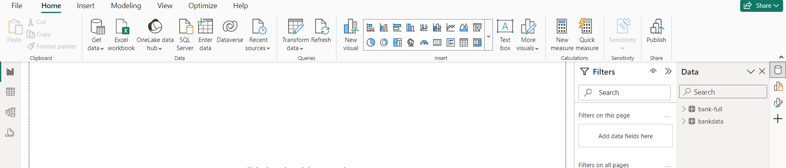
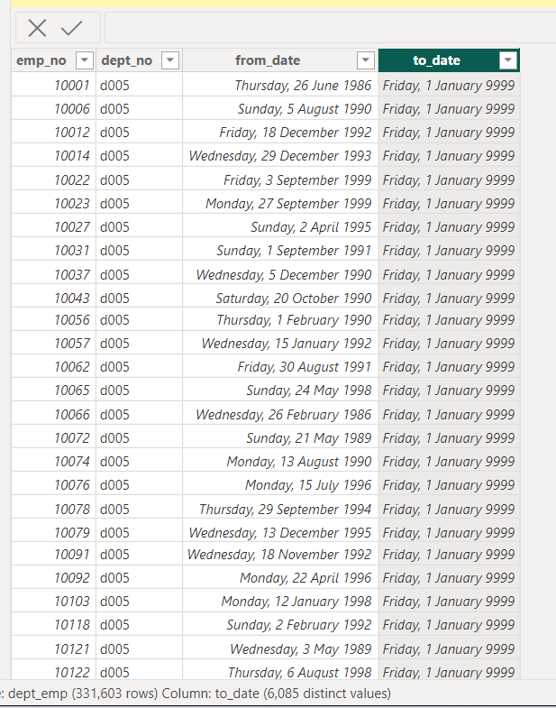
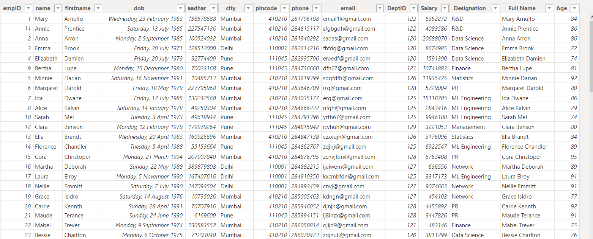
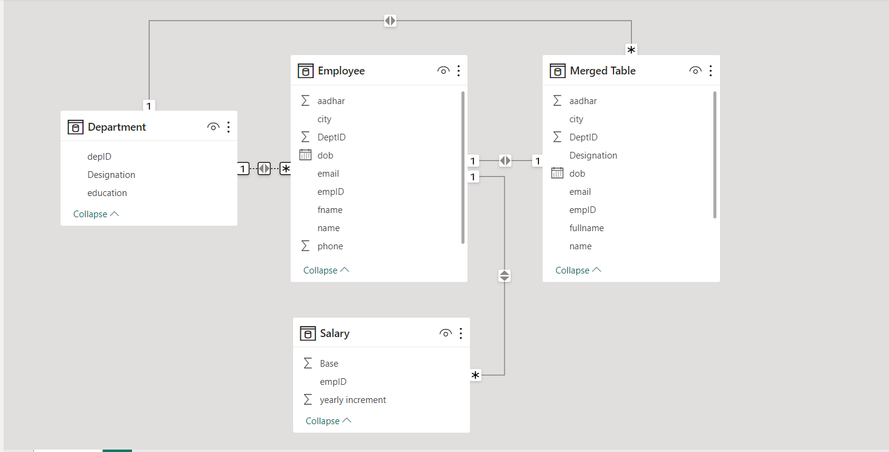
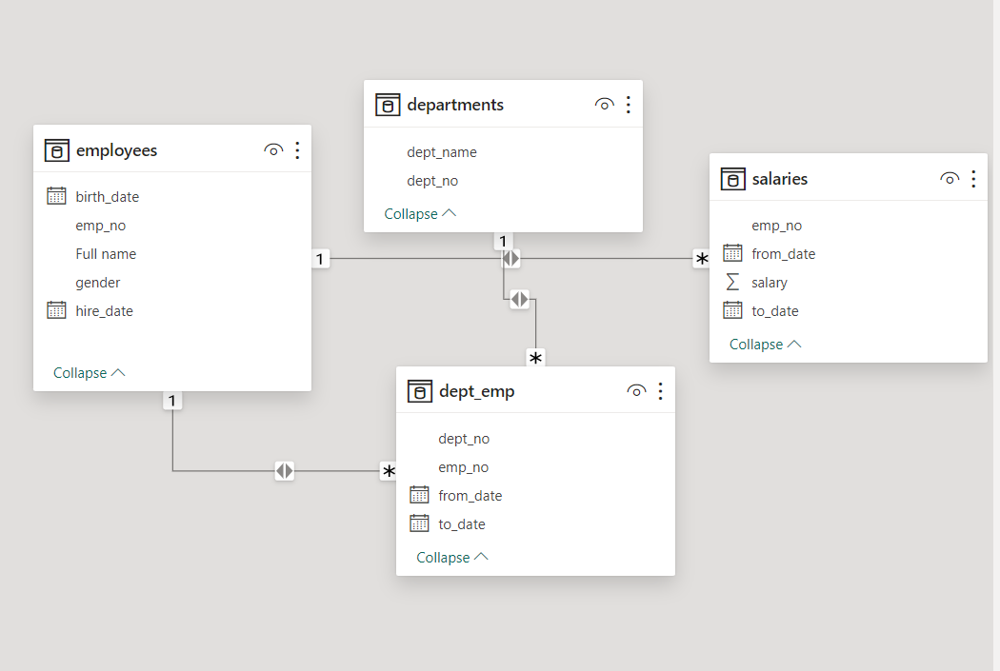

# Power-Bi-Cleaning-and-Merging
This is a power bi task on cleaning and merging different tables .

### TASKS

 **TASK 1**

FIRST TASK WE WILL BE LOOKING INTO IS TO IMPORT A DATASET(BANKFULL) INTO POWER BI THROUGH CSV ROUTE AND ANOTHER SET OF SAME DATASET THROUGH SQL SERVER (FIRST 25 ROWS) AFTER WHICH WE PROCEEDED TO CLEAN IT.

 

this is showing the same dataset imported using the CSV and the SQL route.

- One of the date column has an issue as show in the To-Date column in the image below

  

I fixed this using the Find and Replace fucntion in power query editor.

#### CLEANED DATA

  
THEN I PROCEEDED TO CREATE THE FOLLOWING MEASURES USING DAX

- CREATED a new column named ‘Age band’ containing the following;
‘Young’ for ages below 30
‘Mid-aged’ for ages between 30 and 50
‘Old’ for ages above 50

  measure = Age band = if('bank-full'[age] < 30, "Young", if('bank-full'[age] >= 30 && 'bank-full'[age] <= 50, "Mid-aged", if('bank-full'[age] > 50 , "Old")))

- Average age of depositors(measure)

MEASURE = Average age of depositors = AVERAGE('bank-full'[age])

Average loan duration

MEASURE = Average loan duration = AVERAGE('bank-full'[duration])

- Created a measure calculating the total balance for:
Job: Technician
Marital: Single and Married
MEASURES = SINGLE
Single bal = CALCULATE(SUM('bank-full'[balance]),'bank-full'[marital]= "single")
= MARRIED
Single bal = CALCULATE(SUM('bank-full'[balance]),'bank-full'[marital]= "Married")

- Created a measure to get the number of depositors on Loan

MEASURES = Loan takers = CALCULATE(count('bank-full'[loan]),'bank-full'[loan] = "yes")

NON-LOAN TAKERS 

MEASURES = non Loan takers = CALCULATE(count('bank-full'[loan]),'bank-full'[loan] = "no")

### **TASK 2**

SECOND TASK WAS WITH ANOTHER DATASET WITH 3 TABLES(EMPLOYEES), IMPORTED INTO POWER BI USING CSV
THE TABLE WAS INSPECTED AFTER IMPORTATION AND THE FOLLOWING STEPS WERE CARRIED OUT

1. DATA INSPECTION
2. DATATYPE CORRECTIONS
3. COLUMN RENAMING
4. MODELLING
5. TABLE MERGING = I MERGED (AS NEW) THE SALARY AND DEPARTMENT TABLE WITH EMPLOYEE TABLE IN POWER QUERY USING THE MERGED COLUMN FUNCTION , KEEPING ONLY THE TWO NEEDED COLUMN IN BOTH MERGED TABLES.
6. CLOSED AND LOADED THE DATA TO POWER BI.
7. AGE : I created a column using DAX by subtracting the Dob column from today's Date
   formular used : Age = DATEDIFF(04/12/2023, 'Merged Table'[dob], YEAR).
8. Created a full name column by merging the first name and name column.

cleaned data

### MODELLING

 

### THIRD DATASET

Much was done here except the following
1. DATA INSPECTION
2. DATATYPE CORRECTIONS
3. COLUMN RENAMING

### MODELLING

 

